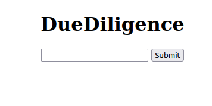

# DueDiligence
DueDiligence is a web application written entirely in Python meant to retrieve all assignments from UTSA's canvas and
put them into a spreadsheet that is sorted by due date and easy to read.

## Dependencies
| Dependency                                       | Version |
|--------------------------------------------------|---------|
| [canvasapi](https://pypi.org/project/canvasapi/) | 3.2.0   |
| [Flask](https://pypi.org/project/Flask/)         | 2.3.3   |
| [loguru](https://pypi.org/project/loguru/)       | 0.7.2   |
| [pandas](https://pypi.org/project/pandas/)       | 2.1.1   |
| [Requests](https://pypi.org/project/requests/)   | 2.31.0  |
| [openpyxl](https://pypi.org/project/openpyxl/)   | 3.1.2   |
## Setup
- Run the following command from the project directory (not inside `dd`)
```shell
pip install -r requirement.txt
```
## Starting the Web Application
- Run the following command from the project directory (not inside `dd`)
```shell
python -m dd
```

## Configuring the Web App
DueDiligence uses Flask to create its web application, so any configuration that can be done on flask can be done on
DueDiligence.

To change the configuration, go to the `__main__.py` file under the `dd` directory.
By default, the configuration for the web app is
```
app.run(host="127.0.0.1", port=8080, debug=True)
```

## How to Use the Web App

- Enter your API token into the textbox. Then click submit.
- DueDiligence will generate the spreadsheet, then automatically download it to the user's computer
under its backend UUID as a `.xlsx` file